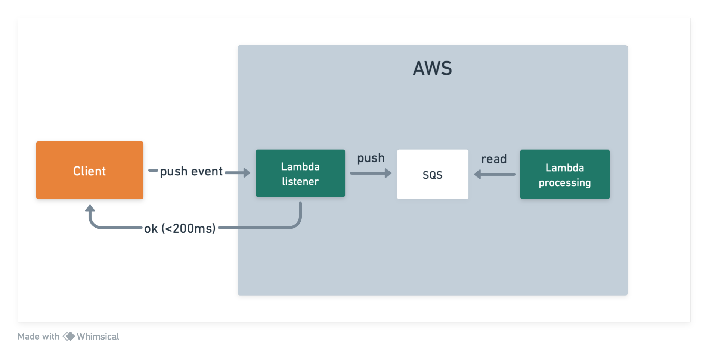
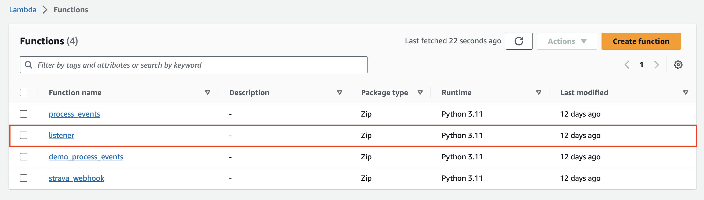
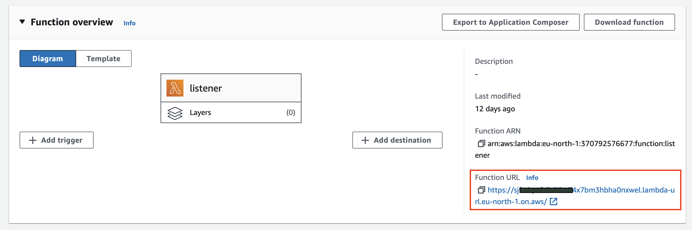
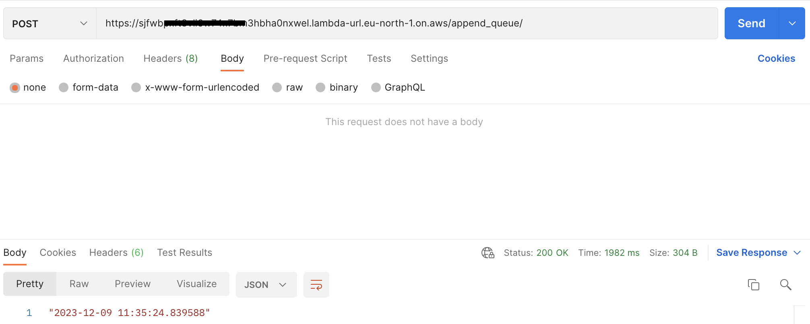
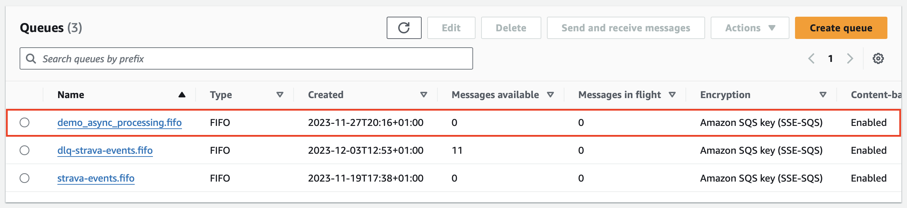
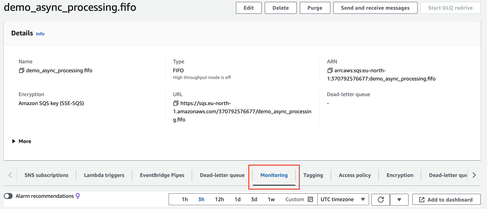
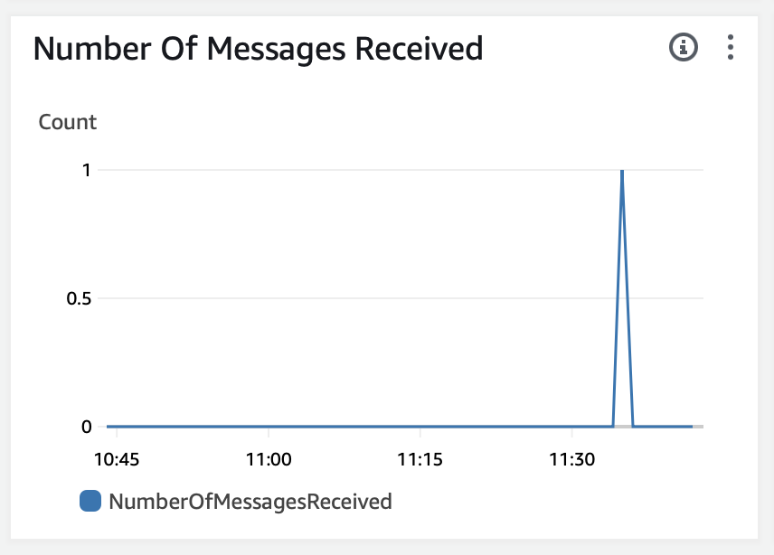
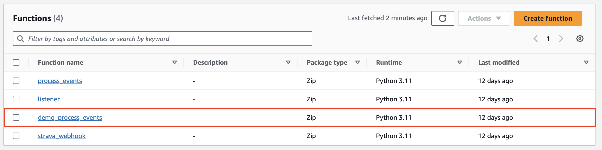
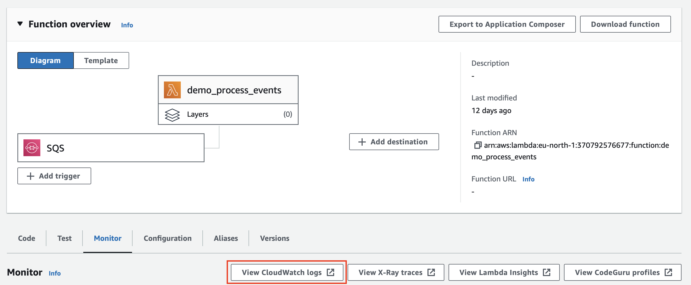
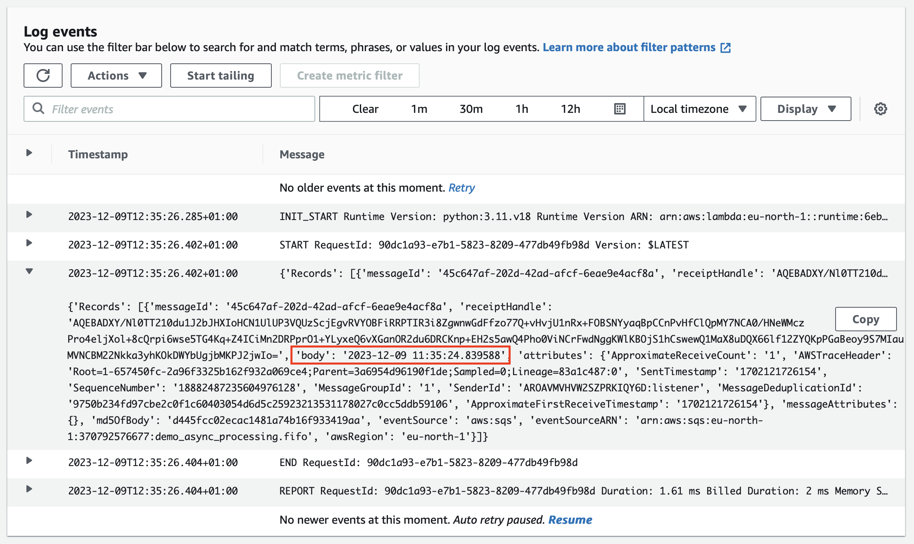

<!-- TOC --><a name="demo-async-lambda-execution"></a>
# Demo : async Lambda execution

Execute code asynchronously in response to an API call.

## Table of Contents

- [Demo : async Lambda execution](#demo-async-lambda-execution)
   * [Table of Contents](#table-of-contents)
   * [Overview](#overview)
   * [Architecture](#architecture)
   * [Getting Started](#getting-started)
      + [Prerequisites](#prerequisites)
      + [Configuration](#configuration)
      + [Deployment](#deployment)
   * [Usage](#usage)


<!-- TOC --><a name="overview"></a>
## Overview

This demo gives an overview of the AWS architecture used in the **StravaToNotion** project to process events from
the Strava webhook. The webhook excepts a response from the API in less than 2 seconds, which explains the choice
of the architecture.

The demo highlights the architecture without all the *business logic* needed in the project.

The demo contains a main.tf file in order to easily reproduce it.


<!-- TOC --><a name="architecture"></a>
## Architecture



The architecture for an async processing in response to a POST request is composed of the following components :
1. A first Lambda function (called *listener*) that defines a URL. This function receives HTTP requests and send
a message to SQS with the content of the request. This function responds in some milliseconds.
2. An SQS queue that receives messages from the listener, and triggers the second Lambda function.
3. A second Lambda function (called *processing*) that reads from the SQS queue and process message 1 by 1.


<!-- TOC --><a name="getting-started"></a>
## Getting Started

To get started, clone the project on your computer and cd to the demo folder :

```shell
git clone https://github.com/thibaultspriet/StravaToNotion.git
cd demo/async-processing
```

<!-- TOC --><a name="prerequisites"></a>
### Prerequisites

Here is the list of prerequisites to start with the demo :
* have git installed on your computer : [see documentation](https://git-scm.com/book/en/v2/Getting-Started-Installing-Git)
* have Terraform installed : [documentation](https://developer.hashicorp.com/terraform/tutorials/aws-get-started/install-cli)
* have the AWS CLI installed : [documentation](https://docs.aws.amazon.com/cli/latest/userguide/getting-started-install.html)
* create an AWS account (free pricing tier below 1M Lambda requests) :
[AWS sign up](https://portal.aws.amazon.com/billing/signup#/start/email)
  * create a group of users and add a user (used for terraform deployment)
  * create an access key for the user (store credentials on your computer)
* [Optional] : the demo use Makefile and the make cli to build and deploy. If your OS does not support
the use of Make, you can manually run scripts defined in make commands.

<!-- TOC --><a name="configuration"></a>
### Configuration

In order to be able to deploy the architecture to AWS with terraform, you need to set the following
environment variables :
* AWS_ACCESS_KEY_ID
* AWS_SECRET_ACCESS_KEY

for more details see : [these tutorial](https://developer.hashicorp.com/terraform/tutorials/aws-get-started/aws-build#prerequisites)


<!-- TOC --><a name="deployment"></a>
### Deployment

To deploy the project to AWS you can simply run (from demo/async-processing):
```shell
make tf
```

It will :
1. Build the project : create a deployment_package.zip with the source code for Lambda functions
2. Deploy the architecture : use the Terraform CLI to deploy the architecture

If you want to update the code of the Lambda functions, to deploy your changes run :
````shell
make deploy
````

<!-- TOC --><a name="usage"></a>
## Usage

Once you deployed the project, you can see it in action by calling the POST endpoint of your listener
with your favorite tool (e.g : Postman).

1. Find your Lambda function (listener) URL :



2. POST request to /append_queue endpoint (you should get the current timestamp as a response)

3. The POST request sent a message to the SQS queue




4.The process_event Lambda function has been triggered
and print the content of the message (current timestamp).



